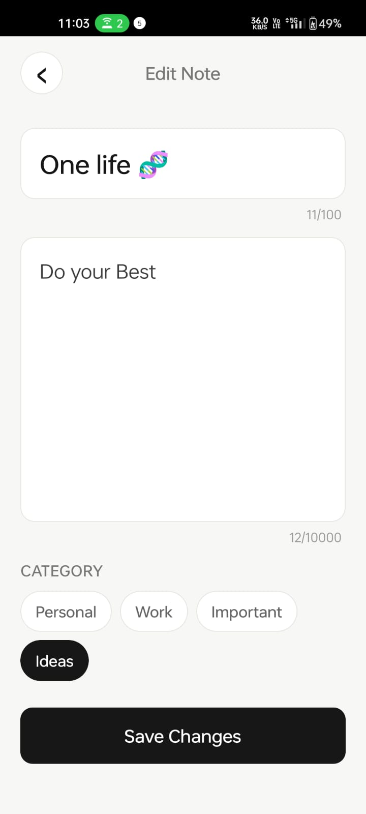
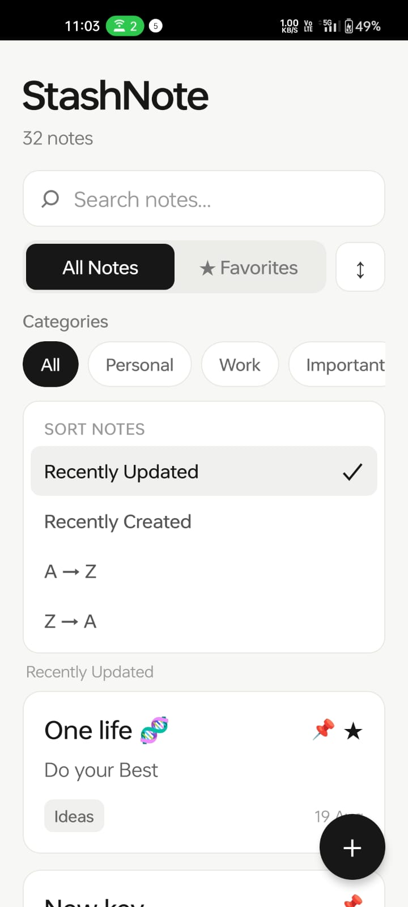

# StashNote

> **Capture it. Find it.**

StashNote is a lightweight React Native note-taking app designed to keep thoughts, ideas, reminders, and important information organized in one place.

The app focuses on a clean and simple experience while providing useful everyday features such as search, categories, favorites, pinning, and sorting.

## Features

* Create, edit, and delete notes
* Search notes by title, content, or category
* Organize notes with categories:

  * Personal
  * Work
  * Important
  * Ideas
* Mark notes as favorites
* Pin important notes
* Sort notes by:

  * Recently Updated
  * Recently Created
  * A → Z
  * Z → A
* Relative date display for recent notes
* Unsaved-changes protection while editing
* Persistent local storage using AsyncStorage
* Safe note data normalization
* Empty-state and no-results handling
* Automated testing with Jest
* ESLint validation

## Tech Stack

* React Native 0.86.2
* React 19.2.3
* JavaScript
* React Navigation
* React Native Paper
* AsyncStorage
* Jest
* ESLint

## Project Structure

```text
StashNote/
├── src/
│   ├── components/
│   │   ├── HighlightedText.js
│   │   └── NoteCard.js
│   ├── navigation/
│   │   └── AppNavigator.js
│   ├── screens/
│   │   ├── AddNoteScreen.js
│   │   ├── EditNoteScreen.js
│   │   ├── HomeScreen.js
│   │   └── NoteDetailScreen.js
│   ├── storage/
│   │   └── noteStorage.js
│   └── utils/
│       └── noteHelpers.js
├── __tests__/
│   ├── App.test.tsx
│   ├── EditNoteScreen.test.js
│   ├── HomeScreen.test.js
│   ├── NoteDetailScreen.test.js
│   ├── noteHelpers.test.js
│   └── noteStorage.test.js
├── App.js
└── package.json
```

## Getting Started

### Prerequisites

You will need:

* Node.js
* npm
* Java Development Kit
* Android Studio
* Android SDK
* Android emulator or physical Android device

### Install dependencies

```bash
npm install
```

### Start Metro

```bash
npm start
```

### Run Android

Open another terminal and run:

```bash
npm run android
```

## Development Commands

### Run lint

```bash
npm run lint
```

### Run tests

```bash
npm test -- --runInBand
```

## Testing

StashNote currently has:

* 6 test suites
* 85 passing tests
* ESLint passing
* Physical Android device verification

Latest test result:

```text
Test Suites: 6 passed, 6 total
Tests:       85 passed, 85 total
Snapshots:   0 total
```

## Data Storage

StashNote stores notes locally on the device using AsyncStorage.

The current version does not require a backend, account, or internet connection for basic note-taking.

## Future Improvements

Possible future improvements include:

* Cloud synchronization
* Backup and restore
* Rich text formatting
* Dark mode
* Note reminders
* Additional customization
* More advanced search and filtering

## Project Status

**Development complete for the current feature set.**

The application has been linted, tested, and verified on a physical Android device.

## License

This project is currently intended as a personal portfolio project.
### Home

<p align="center">
  
</p>

### Sort Notes

<p align="center">
  
</p>

